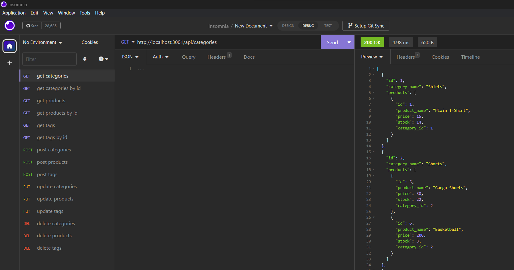

# ecommerce-backEnd

## Description

This is a basic back-end application for an e-commerce website created using starter code from the below repo: 

https://github.com/coding-boot-camp/fantastic-umbrella

## Installation

This project uses Node, MySQL2, Express, Sequelize and dotenv. To insure that all dependencies are installed, run 'npm i' before then starting the server through node ('node server'). Then use mysql to source the schema 9'mysql -u root -p' and 'source schema.sql' before then running seeds (npm run seeds0.

## Usage

Walkthrough video: 
https://drive.google.com/file/d/1W-r1vN6S-Mqd_Un2RGh_DuBfbLjLTnNu/view

Feel free to test endpoints using Insomnia after running the server. Sample endpoint: "http://localhost:3001/api/categories" (GET request)

## Credits

Columbia University Coding Bootcamp

Starter Code: 
https://github.com/coding-boot-camp/fantastic-umbrella 

## License

MIT License

## How to Contribute

Follow the [Contributor Covenant](https://www.contributor-covenant.org/)!
